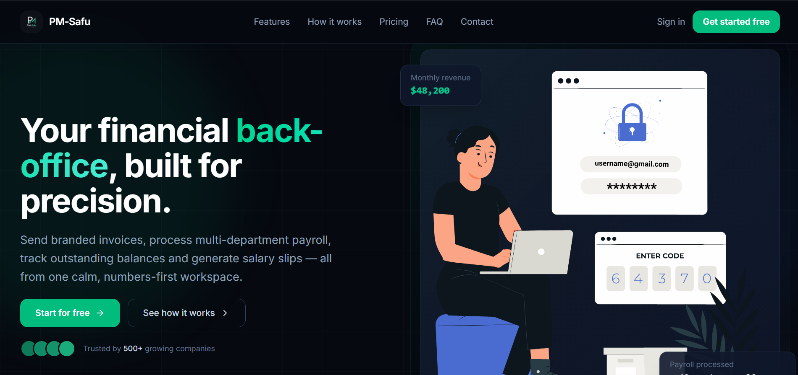
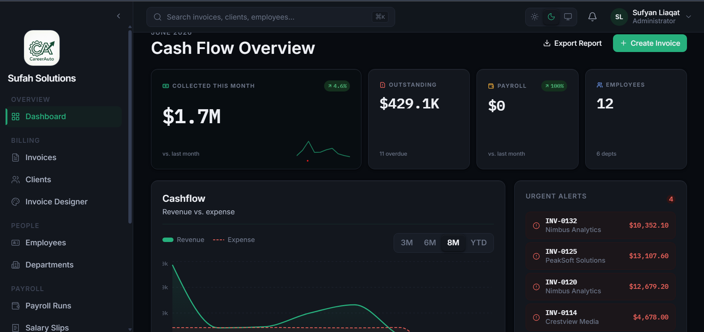
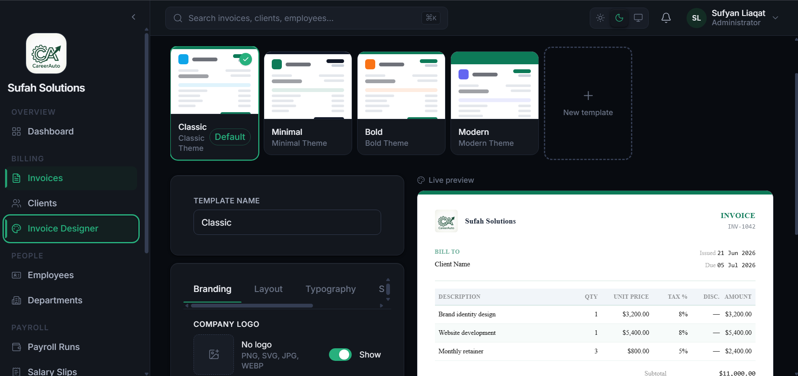

<div align="center">


# PM-Safu — Smart Invoice & Payroll Management Platform

**A multi-tenant SaaS for invoicing, clients, employees and payroll — with a drag-free custom invoice designer, automated payroll runs, and AI-assisted workflows.**

[](https://bun.sh)
[](https://expressjs.com)
[](https://react.dev)
[](https://www.mongodb.com)
[](https://docs.bullmq.io)

</div>

---

## Table of Contents

- [Overview](#overview)
- [Screenshots](#screenshots)
- [Core Features](#core-features)
- [Architecture](#architecture)
- [Tech Stack](#tech-stack)
- [Modules](#modules)
- [Roles & Access Control](#roles--access-control)
- [Project Structure](#project-structure)
- [Getting Started](#getting-started)
  - [Option A — Docker (recommended)](#option-a--docker-recommended)
  - [Option B — Manual / local dev](#option-b--manual--local-dev)
- [Environment Variables](#environment-variables)
- [Seeding Data](#seeding-data)
- [Demo Credentials](#demo-credentials)
- [API Documentation](#api-documentation)
- [Background Jobs](#background-jobs)
- [Security](#security)
- [License](#license)

---

## Overview

**PM-Safu** is a production-style, multi-tenant SaaS platform where many **Companies (tenants)** each manage their own clients, invoices, employees, and payroll in complete isolation. A single platform-level **Super Admin** approves or rejects new company registrations before they can use the system.

The platform is split into **three applications**:

| App | Audience | Description |
|---|---|---|
| **Backend API** | — | Bun + Express REST API, background workers, queues, PDF + email generation |
| **Frontend** | Company users | The tenant-facing app: invoices, clients, employees, payroll, dashboards |
| **Admin Panel** | Super Admin | Platform owner console to approve/suspend companies and view platform stats |

### Core Flow

1. A company registers → status `pending`.
2. Super Admin reviews and **approves** (or rejects) the application from the Admin Panel → an approval email is queued.
3. The company admin logs in → completes the **onboarding wizard** (branding, currency, invoice numbering, payroll settings) → default invoice templates are seeded.
4. Full access unlocks: invoices, clients, employees, payroll and dashboards — **every query is scoped to the `companyId` derived from the JWT**, never trusting client input.

---

## Screenshots

> Add your screenshots to `docs/screenshots/` using the filenames below and they will render automatically.

### Landing Page


### Company Dashboard


### Invoice Designer


### Reports


---

## Core Features

### Invoicing
- Full invoice lifecycle: `draft → sent → paid / partially_paid → overdue / cancelled`.
- **Custom Invoice Designer** — a fully serializable design engine (layout, branding, typography, toggleable & reorderable sections, item-table columns, watermark) that drives both the live preview and the PDF renderer.
- Per-company invoice numbering with atomic, collision-free counters (`INV-0001`).
- Line items with quantity, unit price, per-line tax & discount; totals are always recomputed server-side.
- Record partial payments with full payment history.
- **Public share links** — read-only, no-auth client-facing invoice view and PDF download via a secure share token.
- On-demand / queued **PDF generation** (pdfkit).
- Automatic **overdue detection** + payment-reminder emails via a daily scheduled job.

### Payroll
- Reusable **salary structures** (base salary + configurable allowances & deductions, fixed or percentage-of-base).
- **Departments** and a complete **employee** directory (employment type, bank details, emergency contacts, avatars).
- **Payroll runs** — one per pay period; generates a **salary slip** per active employee with a snapshot of computed earnings/deductions.
- Synchronous processing for small teams, **background job processing** for larger companies (configurable threshold).
- Per-slip mark-as-paid, salary-slip PDFs, and payroll expense reports.

### Clients & CRM
- Client directory with billing addresses, tax IDs, and denormalized totals (invoiced / outstanding) for fast dashboards.
- Per-client invoice history.

### Dashboards & Reports
- Aggregated overview: revenue, outstanding, invoice status breakdown, payroll expense, employee count.
- Revenue trends, payroll trends, and top outstanding clients.
- **Excel exports** (ExcelJS) for invoices, payroll and more.

### AI Assist (optional, Groq-powered)
- AI invoice **drafting** and line-item **descriptions**.
- Payroll **insights** and a payroll **chat** assistant.
- Gracefully disabled when no `GROQ_API_KEY` is configured.

### Platform / Super Admin
- Approve, reject, suspend and reactivate companies.
- Platform-wide statistics across all tenants.

### Cross-cutting
- JWT auth (short-lived access + rotating refresh tokens in httpOnly cookies).
- **Role-based access control** across all modules.
- **Audit logging** of every state-changing action.
- Transactional **email** via Brevo (approval, rejection, invites, password reset, invoice delivery, reminders).
- In-app **notifications**.
- Configurable **tax rates** per company.

---

## Architecture

```
                       ┌──────────────────────┐        ┌──────────────────────┐
   Company users  ───► │   Frontend (React)   │        │  Admin Panel (React) │ ◄─── Super Admin
                       │   Vite · :5173       │        │  Vite · :5174        │
                       └──────────┬───────────┘        └──────────┬───────────┘
                                  │                               │
                                  ▼   REST  /api/v1   ◄───────────┘
                       ┌──────────────────────────────────────────┐
                       │        Backend API (Bun + Express)        │
                       │  Auth · RBAC · Tenant isolation · Zod     │
                       │  Controllers · Swagger · PDF · Email      │
                       └───────┬───────────────────────┬──────────┘
                               │                        │ enqueue
                     ┌─────────▼────────┐      ┌────────▼─────────┐
                     │     MongoDB      │      │   Redis + BullMQ │
                     │   (Mongoose)     │      │   queues/cache   │
                     └──────────────────┘      └────────┬─────────┘
                                                        │ consume
                                               ┌────────▼─────────┐
                                               │  Worker process  │
                                               │ email·pdf·payroll│
                                               │   ·reminders     │
                                               └──────────────────┘
```

**Tenancy model:** single database, shared collections, with a `companyId` discriminator on every tenant-scoped document. `tenant.middleware` injects `req.companyId` from the verified JWT, and every query is scoped to it. Super Admin lives in a separate collection and namespace (`/api/v1/super-admin/*`).

---

## Tech Stack

| Layer | Technologies |
|---|---|
| **Runtime** | [Bun](https://bun.sh) ≥ 1.2 |
| **Backend** | TypeScript · Express 5 · Mongoose (MongoDB) · Zod · JWT · Helmet |
| **Queues & Jobs** | BullMQ + Redis (ioredis) |
| **Email** | Brevo (transactional API) |
| **PDF** | pdfkit · QRCode |
| **Exports** | ExcelJS |
| **AI** | Groq SDK (optional) |
| **Logging** | Winston (daily rotate) · Morgan |
| **Frontend / Admin** | React 19 · Vite · Tailwind CSS 4 · React Router 7 · TanStack Query · Zustand · React Hook Form · Recharts · Framer Motion · Lottie |
| **Infra** | Docker · Docker Compose · Nginx (static serving) |

---

## Modules

| Module | Backend route base | Description |
|---|---|---|
| Auth | `/auth` | Company + super-admin login, register, refresh, password reset |
| Super Admin | `/super-admin` | Company approval, suspension, platform stats |
| Company | `/company` | Profile, onboarding/setup, logo, invoice & payroll settings |
| Users | `/users` | Internal user invites, roles, activation |
| Clients | `/clients` | Customer directory + invoice history |
| Invoice Templates | `/invoice-templates` | Custom invoice designer (CRUD, clone, preview, set default) |
| Invoices | `/invoices` | Lifecycle, payments, send, PDF, public share links |
| Departments | `/departments` | Org structure |
| Employees | `/employees` | Employee directory + salary-slip history + avatars |
| Salary Structures | `/salary-structures` | Reusable pay bands (allowances/deductions) |
| Payroll | `/payroll` | Pay-period runs + reports |
| Salary Slips | `/salary-slips` | Per-employee slips, mark-paid, PDF |
| Dashboard | `/dashboard` | Aggregated overview, trends, breakdowns |
| Tax Rates | `/tax-rates` | Per-company configurable tax rates |
| Exports | `/export` | Excel exports |
| AI | `/ai` | Invoice drafting, payroll insights & chat (Groq) |
| Notifications | `/notifications` | In-app notifications |
| Audit Logs | `/audit-logs` | State-change history |

---

## Roles & Access Control

| Role | Capabilities |
|---|---|
| **Super Admin** | Platform owner — approves/suspends companies, views platform stats (separate collection, no tenant) |
| **Company Admin** | Full access within their company, including users & settings |
| **HR Manager** | Departments, employees, salary structures, payroll, salary slips |
| **Accountant** | Invoices, clients, tax rates, financial reports |
| **Staff** | Limited — views their own salary slips |

RBAC is enforced on both the API (`rbac.middleware`) and the frontend route guards.

---

## Project Structure

```
payroll-management/
├── backend/            # Bun + Express API, workers, queues, models
│   ├── src/
│   │   ├── config/         # env validation, db, redis, brevo, constants
│   │   ├── controllers/    # request handlers (one per resource)
│   │   ├── lib/            # token, email, pdf, storage, logger, swagger
│   │   ├── middlewares/    # auth, tenant, rbac, validate, error, audit, upload
│   │   ├── models/         # Mongoose schemas
│   │   ├── queues/         # BullMQ producers
│   │   ├── routers/        # Express routers (mounted under /api/v1)
│   │   ├── schemas/        # Zod request validation
│   │   ├── templates/      # HTML email templates
│   │   ├── utils/          # apiError, apiResponse, pagination, calculators
│   │   ├── workers/        # BullMQ consumers + worker bootstrap
│   │   └── scripts/        # seedSuperAdmin, seedDemo
│   ├── API_DOCUMENTATION.md
│   └── BACKEND_DESIGN.md
├── frontend/           # React tenant app (company users)
│   └── src/{pages,components,routes,store,constants,animations}
├── admin-panel/        # React super-admin console
│   └── src/{pages,components}
├── docs/screenshots/   # README screenshots
├── docker-compose.yml  # mongo · redis · backend · worker · frontend · admin
└── .env.example
```

---

## Getting Started

### Prerequisites

- [Bun](https://bun.sh) ≥ 1.2 (for local dev)
- [Docker](https://www.docker.com/) & Docker Compose (for the containerized setup)
- MongoDB & Redis (provided automatically by Docker Compose)
- A [Brevo](https://www.brevo.com/) account + API key (for email)
- *(optional)* a [Groq](https://groq.com/) API key (for AI features)

### Option A — Docker (recommended)

The fastest way to run the whole stack (MongoDB, Redis, API, worker, frontend, admin panel).

```bash
# 1. Clone
git clone <your-repo-url> payroll-management
cd payroll-management

# 2. Configure
cp .env.example .env
#   then edit .env — set JWT secrets, Brevo keys, and (optionally) super-admin seed creds

# 3. Build & run
docker compose up -d --build
```

Once running:

| Service | URL |
|---|---|
| Frontend (company app) | http://localhost:5173 |
| Admin panel (super admin) | http://localhost:5174 |
| Backend API | http://localhost:8000/api/v1 |
| Swagger / API docs | http://localhost:8000/api/docs |
| Health check | http://localhost:8000/api/v1/health |

> **Note on URLs:** the `APP_BASE_URL` protocol/host is baked into stored file URLs (e.g. company logos). It must match how browsers actually reach the backend. On a bare IP without TLS, use `http://` everywhere. See the comments in `.env.example`.

### Option B — Manual / local dev

Run each app in its own terminal. You'll need MongoDB and Redis running locally (or via `docker compose up -d mongo redis`).

**Backend API + worker**

```bash
cd backend
bun install
cp .env.example .env        # fill in values (MONGODB_URI, REDIS_URL, JWT secrets, Brevo)

bun run dev                 # API server  → http://localhost:8000
bun run dev:worker          # background workers (separate process)
bun run seed:superadmin     # create the platform super admin
```

**Frontend (company app)**

```bash
cd frontend
bun install                 # or npm install
bun run dev                 # → http://localhost:5173
```

**Admin panel (super admin)**

```bash
cd admin-panel
bun install                 # or npm install
bun run dev                 # → http://localhost:5174
```

Set `VITE_API_URL` for the frontend and admin panel (defaults to `http://localhost:8000/api/v1`).

---

## Environment Variables

Copy `.env.example` to `.env` and fill in the values. Key variables:

| Variable | Required | Description |
|---|---|---|
| `JWT_ACCESS_SECRET` | ✅ | Access-token signing secret (min 16 chars) |
| `JWT_REFRESH_SECRET` | ✅ | Refresh-token signing secret |
| `COOKIE_SECRET` | ✅ | Cookie signing secret |
| `MONGODB_URI` | ✅ | MongoDB connection string (auto-set in Docker) |
| `REDIS_URL` | ✅ | Redis connection string (auto-set in Docker) |
| `BREVO_API_KEY` | ✅ | Brevo transactional email API key |
| `BREVO_SENDER_EMAIL` | ✅ | Verified sender email |
| `BREVO_SENDER_NAME` | | Sender display name (default `PM-Safu`) |
| `APP_BASE_URL` | ✅ | Public URL of the backend (baked into stored file URLs) |
| `CLIENT_BASE_URL` | ✅ | Public URL of the frontend (CORS + links) |
| `ADMIN_BASE_URL` | ✅ | Public URL of the admin panel |
| `VITE_API_URL` | ✅ | API base URL baked into frontend/admin builds |
| `GROQ_API_KEY` | | Enables AI features when set |
| `GROQ_MODEL` / `GROQ_MODEL_FAST` | | Groq model names |
| `SUPERADMIN_SEED_EMAIL` / `SUPERADMIN_SEED_PASSWORD` | | Used by the super-admin seed script |
| `PAYROLL_SYNC_THRESHOLD` | | Employee count above which payroll runs in the background (default 50) |

Environment is validated with Zod at boot (`backend/src/config/env.ts`) — the server refuses to start with invalid config.

---

## Seeding Data

```bash
cd backend

# Seed the platform super admin (uses SUPERADMIN_SEED_* from .env)
bun run seed:superadmin

# Seed a fully-populated demo company (12 employees, ~130 invoices, 12 payroll runs, etc.)
bun run seed:demo

# Wipe & re-seed the demo company
bun run seed:demo:reset
```

The demo seed creates realistic data so every chart, table and dashboard renders out of the box.

---

## Demo Credentials

After running `bun run seed:demo` (defaults — override via env vars):

| Role | Email | Password |
|---|---|---|
| Company Admin | `demo@pmsafu.com` | `Demo@1234` |
| Super Admin | `superadmin@pmsafu.com` | `Admin@1234` |

> The demo also creates HR, accountant and staff users (all using the same demo password). Change these defaults before deploying anywhere public.

---

## API Documentation

- **Interactive Swagger UI:** `http://localhost:8000/api/docs`
- **Full endpoint reference:** [`backend/API_DOCUMENTATION.md`](backend/API_DOCUMENTATION.md)
- **Architecture & data model:** [`backend/BACKEND_DESIGN.md`](backend/BACKEND_DESIGN.md)

All responses follow a standard shape:

```jsonc
// success
{ "success": true, "message": "...", "data": { }, "meta": { "page": 1, "limit": 20, "total": 0, "totalPages": 0 } }

// error
{ "success": false, "message": "...", "errors": [{ "field": "email", "message": "Invalid email" }] }
```

---

## Background Jobs

Powered by **BullMQ + Redis**, consumed by a separate worker process:

| Queue | Jobs |
|---|---|
| `email` | Approval / rejection / invite / password-reset / invoice-delivery / reminder emails |
| `pdf` | Invoice & salary-slip PDF generation |
| `payroll` | Large payroll-run processing (above `PAYROLL_SYNC_THRESHOLD`) |
| `reminder` | Daily cron: flip overdue invoices, send due-soon reminders |

Queues are configured with retries, exponential backoff, and failure logging.

---

## Security

- Passwords hashed with bcrypt.
- Helmet HTTP headers; CORS locked to configured client/admin origins.
- Rate limiting on auth and AI endpoints (Redis-backed).
- Strict tenant isolation — every tenant query is scoped to the JWT-derived `companyId`; client-supplied `companyId` is never trusted.
- Public invoice share links are read-only and resolved only via opaque share tokens (no tenant leakage).
- Request validation with Zod; input sanitization against NoSQL injection.
- Audit logging of all state-changing actions.

---

## License

This project is provided as-is. Add your license of choice here.

---

<div align="center">

**PM-Safu** — Invoices, payroll and clients in one place.

</div>
